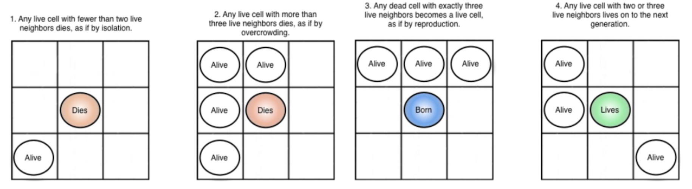

# Game of Life

## Rules of the Game
The game is played on a two-dimensional grid (or board). Each grid location is either empty or populated by a single cell. A location’s **neighbors** are any cells in the surrounding **eight adjacent locations**. The simulation of starts from an initial state of populated locations and then **progresses through time**. The evolution of the board state is governed by a few simple rules:
1. Each populated location with one or zero neighbors dies.
2. Each populated location with four or more neighbors dies.
3. Each populated location with two or three neighbors survives.
4. Each unpopulated location that becomes populated if it has exactly **three** populated neighbors. 
5. All updates are performed simultaneously **in parallel**.

